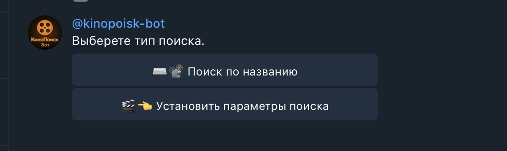
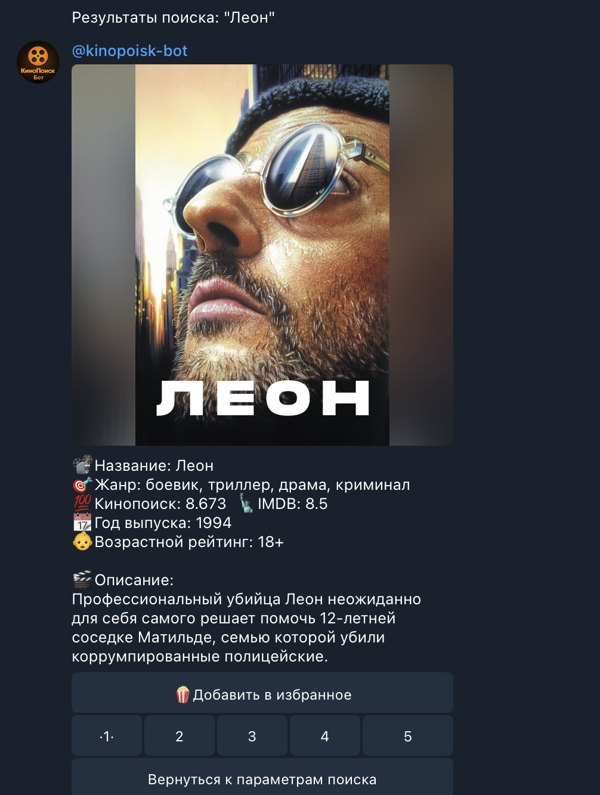
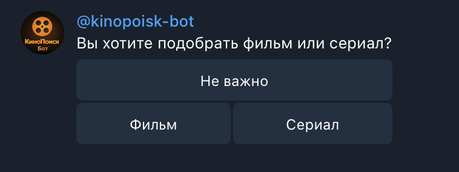
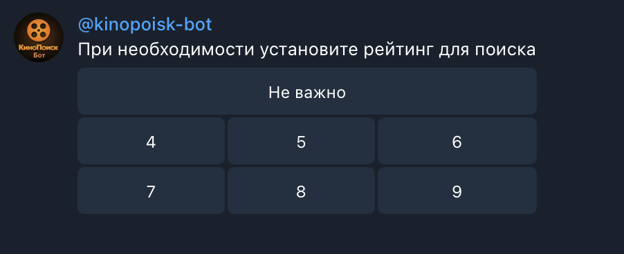
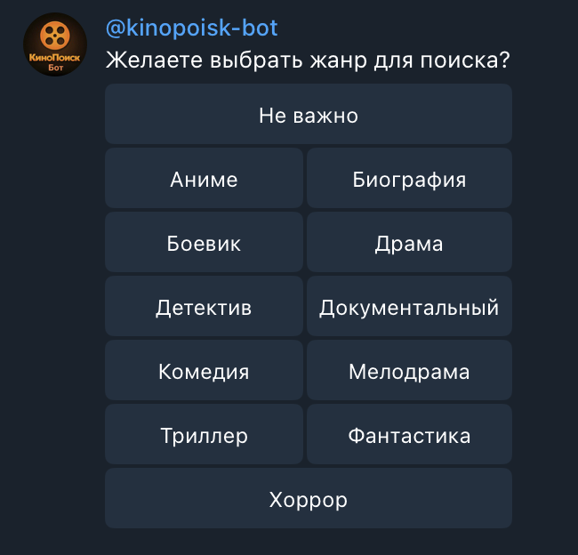
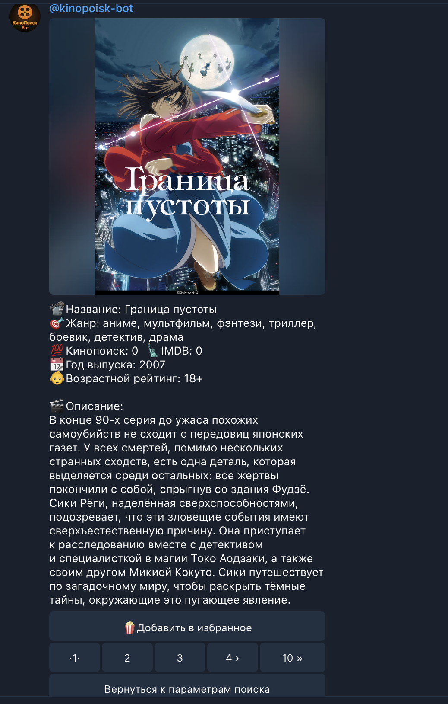

# **Телеграмм-бот Кинопоиск**
Данный бот реализует поиск фильмов и сериалов через API Кинопоиска. Через данный бот возможен поиск по названию фильма или поиск по своим параметрам. Так же возможно сохранение выбора в "Избранное".

Собственные параметры включают следующие критерии:
- поиск фильма или сериала
- жанр
- рейтинг

## Содержание
- [Технологии](#технологии)
- [Начало работы](#начало-работы)
- [Требования](#требования)
- [Описание API](#описание-работы-с-api-в-телеграм-боте)
- [Описание сценариев](#описание-сценариев-и-результата-бота)
- [Зачем это все](#зачем-вы-разработали-этот-проект)

## Технологии
- [Python](https://www.python.org/)
- [Peewee](https://docs.peewee-orm.com/)
- [API Кинопоиска](https://api.kinopoisk.dev/documentation)

## Начало работы
Что бы установить проект необходимо скопировать репозиторий себе на устройство.
Для этого выполните эту команду в терминале:

```sh
$ git clone https://github.com/NikitaChigarov/telegram_bot_kinopoisk.git
```

Затем установите все библиотеки из файла (находится внутри клонированного репозитория) requirements.txt:


## Требования
Для установки и запуска проекта, необходим [Python](https://www.python.org/) v3.4.

## Описание работы с API в телеграм боте

### API кинопоиска использует 2 разных запроса:
 - поиск фильма/сериала по названию
 - поиск фильма/сериала по собственным параметрам

Из любого сценария бота можно вернуться к выбору типа поиска.  При выдаче результата поиска, результат подается постранично с использованием пагинации.  Результат поиска можно сохранить в "Избранное" или вернуться к выбору типа поиска.

## Описание сценариев и результата бота:
___
### Сценарий №1 (поиск по названию)

*Выбор типа поиска*



*Поиск по названию*



___
### Сценарий №2 (поиск по собственным параметрам)

*Выбор типа поиска*


*Определения типа сериал или фильм*



*Установка рейтинга*



*Выбор жанра*



*Результат*



___
## Зачем вы разработали этот проект?
Данный проект был подготовлен в рамках итоговой работы, после прохождения курса Skillbox "Основы Python". 
